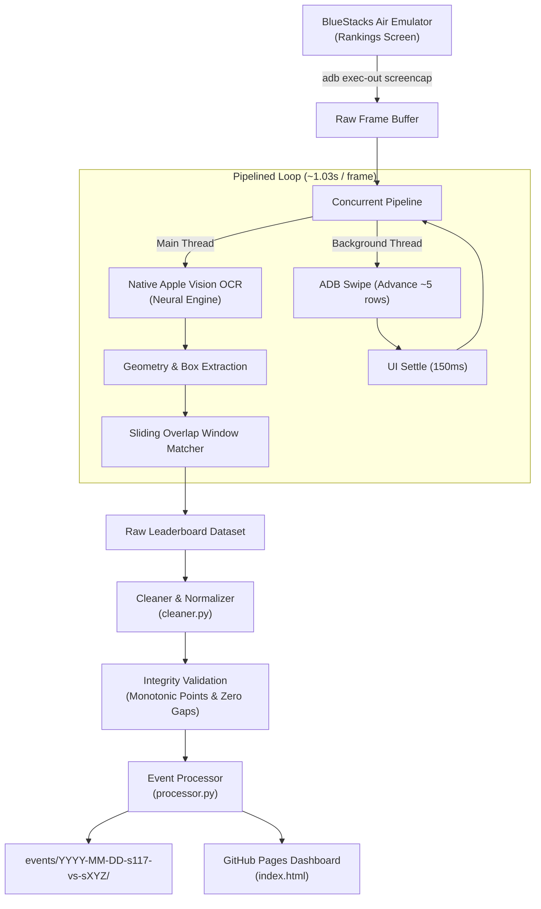

# Capitol War Ingestion Pipeline — Z Route: Redemption

A high-performance, automated data gathering pipeline for extracting, cleaning, and publishing complete Capitol War event leaderboards from **BlueStacks Air** directly to **GitHub Pages**.

---

## Architecture Overview



---

## Prerequisites

1. **Host Machine:** macOS (Apple Silicon recommended for native Neural Engine hardware OCR).
2. **Android Emulator:** BlueStacks Air running *Z Route: Redemption*.
3. **Android Debug Bridge (`adb`):**
   ```sh
   brew install android-platform-tools
   ```
4. **Apple Swift Compiler:** Included with Xcode or Command Line Tools:
   ```sh
   xcode-select --install
   ```

---

## Quick Start (One Command)

1. Open *Z Route: Redemption* in BlueStacks Air and navigate to:
   **Capitol Event &rarr; Rankings Tab**.
2. Run the pipeline from the repository root:

```sh
python3 pipeline/run_pipeline.py --date "2026-10-03" --opponent "120"
```

The pipeline will:
- Auto-detect the BlueStacks ADB instance (`127.0.0.1:5565`).
- Automatically compile `vision_ocr.swift` if needed.
- Rewind the leaderboard smoothly to Rank 1.
- Stream screencaps and execute asynchronous scrolling at ~1 second per frame.
- Automatically detect the bottom of the leaderboard (hard stop).
- Normalize OCR artifacts and alliance tags (e.g. consolidating `[P1MP] JU1CE`).
- Validate data integrity (0 missing ranks, monotonic point ordering).
- Generate event assets under `events/<date>-s117-vs-s<opponent>/`.
- Update `manifest.json`, `manifest.js`, and the interactive GitHub Pages dashboard.

3. Push the new event to GitHub Pages:
```sh
git add .
git commit -m "feat(event): add Capitol War 2026-10-03 dataset"
git push origin main
```

---

## Command-Line Arguments

| Flag | Default | Description |
| :--- | :---: | :--- |
| `--date` | `Today` | Date of the Capitol event (`YYYY-MM-DD`). |
| `--opponent` | `119` | Opponent server number (e.g. `119`, `120`). |
| `--home` | `117` | Home server number (default: `117`). |
| `--device` | Auto | ADB device identifier (auto-detects BlueStacks). |
| `--no-rewind` | False | Skip scrolling back to Rank 1 before starting. |
| `--from-file` | None | Skip capture and reprocess an existing raw JSON file. |

---

## Pipeline Components

* **`run_pipeline.py`**: Unified orchestrator managing ADB streaming, concurrency, and pipeline stages.
* **`vision_ocr.swift`**: High-performance Swift worker using Apple's `VNRecognizeTextRequest` (`Vision` framework) for sub-300ms multilingual character recognition.
* **`cleaner.py`**: Handles OCR text normalization, bracket repairs, server tag detection, and mathematical data integrity verification.
* **`processor.py`**: Builds alliance rosters, aggregates server statistics, creates spreadsheet CSVs, JSON data models, and registers events into the GitHub Pages site manifest.

---

## Troubleshooting

* **Device not detected:** Verify ADB sees the BlueStacks emulator:
  ```sh
  adb devices
  ```
  If unlisted, connect manually: `adb connect 127.0.0.1:5565`.
* **Ranks skipping or bouncing:** Ensure the BlueStacks window is active and at 1080x1920 portrait resolution.
* **Reprocessing without recapturing:** If you want to update alliance rules on an existing event without re-running ADB:
  ```sh
  python3 pipeline/run_pipeline.py --from-file events/2026-09-19-s117-vs-s119/rankings.json
  ```
